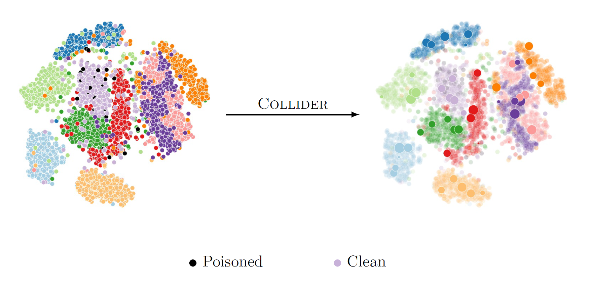

## COLLIDER: A Robust Training Framework for Backdoor Data
*Hadi M. Dolatabadi, Sarah Erfani, and Christopher Leckie 2022*

[](https://arxiv.org/abs/22xx.xxxxx)
[](https://opensource.org/licenses/MIT)

This repository contains the official pytorch implementation of the ACCV 2022 paper [_COLLIDER: A Robust Training Framework for Backdoor Data_]().

<p align="center">
  
</p>

Abstract: *Deep neural network (DNN) classifiers are vulnerable to backdoor attacks. An adversary poisons some of the training data in such attacks by installing a trigger. The goal is to make the trained DNN output the attacker's desired class whenever the trigger is activated while performing as usual for clean data. Various approaches have recently been proposed to detect malicious backdoored DNNs. However, a robust, end-to-end training approach like adversarial training, is yet to be discovered for backdoor poisoned data. In this paper, we take the first step toward such methods by developing a robust training framework, COLLIDER, that selects the most prominent samples by exploiting the underlying geometric structures of the data. Specifically, we effectively filter out candidate poisoned data at each training epoch by solving a geometrical coreset selection objective. We first argue how clean data samples exhibit (1) gradients similar to the clean majority of data and (2) low local intrinsic dimensionality (LID). Based on these criteria, we define a novel coreset selection objective to find such samples, which are used for training a DNN. We show the effectiveness of the proposed method for robust training of DNNs on various poisoned datasets, reducing the backdoor success rate significantly.*

### Requirements

To install requirements:

```setup
pip install -r requirements.txt
```

### Generating Poisoned Datasets

To generate poisoned datasets, use the `data_poisoning.ipynb` notebook. Alternatively, you can load your own poisoned dataset to train a model in the `main.py`. To this end, just find the data loaders and create your own dataloading pipeline.

### Training 

To train a neural network using COLLIDER, specify the arguments and run the following script:

```bash
python main.py 
      --gpu <GPU_DEVICE> \
      --dataset <DATASET_NAME> \
      --backdoor <ATTACK_TYPE> \
      --injection_rate <POISONING_RATE> \
      --target_class <ATTACK_TARGET_CLASS> \
      --data_seed <DATASET_SEED>  \ 
      --arch <MODEL_ARCHITECTURE> \ 
      --epochs <TOTAL_TRAINING_EPOCHS> \
      --batch-size <BATCH_SIZE> \
      --lr <SGD_LEARNING_RATE> \
      --wd <SGD_WEIGHT_DECAY> \
      --momentum <SGD_MOMENTUM> \
      --enable_coresets \
      --fl-ratio <CORESET_SIZE> \
      --lid_start_epoch <WHEN_TO_START_LID_REG> \
      --lid_overlap <LID_NUMBER_OF_NEAREST_NEIGHBORS> \
      --lid_batch_size <LID_BATCH_SIZE> \
      --lid-lambda <LID_LAGRANGE_MULTIPLIER> \
      --lid_hist <LID_MOVING_AVERAGE_WINDOW>
```

Parameters:

* ```GPU_DEVICE``` &mdash; name of the GPU device
* ```DATASET_NAME``` &mdash; dataset name [cifar10/svhn/imagenet12]
* ```ATTACK_TYPE``` &mdash; backdoor attack type [badnets/cl/sig/htba/wanet/no_backdoor]
* ```POISONING_RATE``` &mdash; the ratio of poisoned data in the target class (between 0 and 1)
* ```ATTACK_TARGET_CLASS``` &mdash; target class of the backdoor attack
* ```DATASET_SEED``` &mdash; dataset seed
* ```MODEL_ARCHITECTURE``` &mdash; neural network architecture
* ```TOTAL_TRAINING_EPOCHS``` &mdash; training epochs
* ```BATCH_SIZE``` &mdash; training batch size
* ```SGD_LEARNING_RATE``` &mdash; SGD optimizer learning rate
* ```SGD_WEIGHT_DECAY``` &mdash; SGD optimizer weight decay 
* ```SGD_MOMENTUM``` &mdash; SGD optimizer momentum
* ```CORESET_SIZE``` &mdash; size of the coreset (between 0 and 1)
* ```WHEN_TO_START_LID_REG``` &mdash; epoch to start LID regularization
* ```LID_NUMBER_OF_NEAREST_NEIGHBORS``` &mdash; number of nearest neighbors in LID computation
* ```LID_BATCH_SIZE``` &mdash; batch size to compute LID
* ```LID_LAGRANGE_MULTIPLIER``` &mdash; Lagrange multiplier to add LID to the coreset selection coeffs
* ```LID_MOVING_AVERAGE_WINDOW``` &mdash; moving average window to average LID

## Results

The primary results of this work are given in the table below. In each multi-row, we give our results for a particular attack type, where we compare a vanilla training vs. training with gradient-based coresets vs. the full COLLIDER objective. As shown, COLLIDER reduces the threat of backdoor attacks significantly.

<p align="center">
    <em>Clean test accuracy (ACC) and attack success rate (ASR) in % for backdoor data poisonings on CIFAR-10 (BadNets and label-consistent) and SVHN (sinusoidal strips) datasets.
		The results show the mean and standard deviation for 5 different seeds.
		The poisoned data injection rate is 10%.
		For BadNets and label-consistent attacks, the coreset size is 0.3.
            It is 0.4 for sinusoidal strips.</em>
</p>
<table style="width:750px" align="center">
<tbody>
<tr class="odd">
<th style="text-align:left" rowspan="2">Backdoor Attack</th>
<th style="text-align:center" rowspan="2">Data</th>
<th style="text-align:center" rowspan="2">Training</th>
<th style="text-align:center" colspan="2">Performance Measures</th>
</tr>
<tr class="even">
<th style="text-align:center">ACC (%)</th>
<th style="text-align:center">ASR (%)</th>
</tr>
<tr class="odd">
<th style="text-align:left" rowspan="3">BadNets</th>
<th style="text-align:center" rowspan="3">CIFAR-10</th>
<td style="text-align:center">Vanilla</td>
<td style="text-align:center">92.19&plusmn0.20</td>
<td style="text-align:center">99.98&plusmn0.02</td>
</tr>
<tr class="even">
<td style="text-align:center">Coresets</td>
<td style="text-align:center">84.86&plusmn0.47</td>
<td style="text-align:center">74.93&plusmn34.6</td>
</tr>
<tr class="odd">
<td style="text-align:center">COLLIDER</td>
<td style="text-align:center">80.66&plusmn0.95</td>
<td style="text-align:center">4.80&plusmn1.49</td>
</tr>
<tr class="even">
<th style="text-align:left" rowspan="3">Label Consistent</th>
<th style="text-align:center" rowspan="3">CIFAR-10</th>
<td style="text-align:center">Vanilla</td>
<td style="text-align:center">92.46&plusmn0.16</td>
<td style="text-align:center">100</td>
</tr>
<tr class="odd">
<td style="text-align:center">Coresets</td>
<td style="text-align:center">83.87&plusmn0.36</td>
<td style="text-align:center">7.78&plusmn9.64</td>
</tr>
<tr class="even">
<td style="text-align:center">COLLIDER</td>
<td style="text-align:center">82.11&plusmn0.62</td>
<td style="text-align:center">5.19&plusmn1.08</td>
</tr>
</tr>
<tr class="odd">
<th style="text-align:left" rowspan="3">Sinusoidal Strips </th>
<th style="text-align:center" rowspan="3">SVHN</th>
<td style="text-align:center">Vanilla</td>
<td style="text-align:center">95.79&plusmn0.20</td>
<td style="text-align:center">77.35&plusmn3.68</td>
</tr>
<tr class="even">
<td style="text-align:center">Coresets</td>
<td style="text-align:center">92.30&plusmn0.19</td>
<td style="text-align:center">24.30&plusmn8.15</td>
</tr>
<tr class="odd">
<td style="text-align:center">COLLIDER</td>
<td style="text-align:center">89.74&plusmn0.31</td>
<td style="text-align:center">6.20&plusmn3.69</td>
</tr>
</tbody>
</table>


## Acknowledgement

This repository is mainly built upon [CRUST](https://github.com/snap-stanford/crust).
We thank the authors of this repository.

## Citation

If you have found our code or paper beneficial to your research, please consider citing it as:
```bash
@inproceedings{dolatabadi2022collider,
  title={COLLIDER: A Robust Training Framework for Backdoor Data},
  author={Hadi Mohaghegh Dolatabadi and Sarah Erfani and Christopher Leckie},
  booktitle = {Proceedings of the Asian Conference on Computer Vision ({ACCV})},
  year={2022}
}
```
